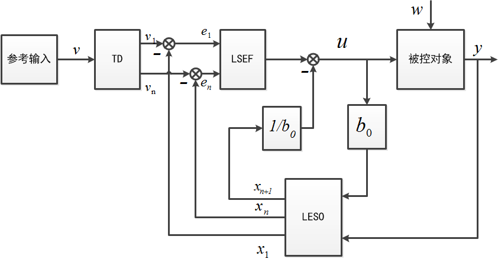
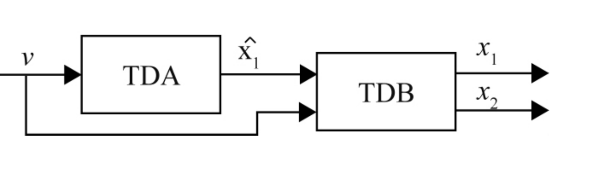
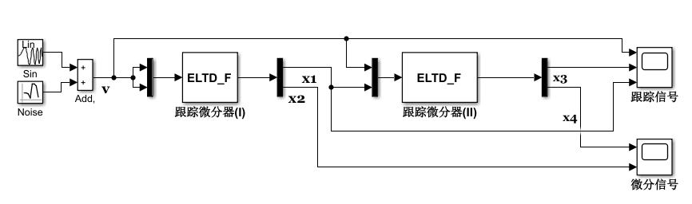
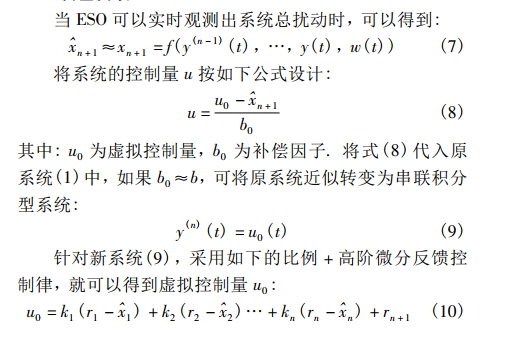
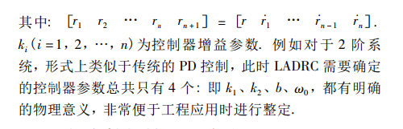

# Part Ⅰ—ADRC

## 1.1 自抗扰控制原理

ADRC(Active Disturbance Rejection Control)，包括跟踪微分器 (tracking differentiator，TD)、非线性
状态误差反馈控制律 (nonlinear state error feedback，NLSEF)和扩张状态观测器 (extended state
observer，ESO)三部分。自抗扰控制的独特之处在于它将作用于被控对象的所有不确定因素均视为“未知扰动”，并利用对象的输入输出信息对其进行实时估计并给予补偿，这种思想突破了“绝对不变性原理”和“内模原理”的局限性，是在发扬 PID 控制的精髓— “基于误差来消除误差”，并吸收现代控制理论成就${^{[1]}}$。


## 1.2 跟踪微分器（TD）

### 1.2.1 非线性(快速)跟踪微分器（TD）原理

**非线性（快速）跟踪微分器原理**

 最快地跟踪输入信号的动态环节获取微分信号${^{[3]}}$。


$$
\begin{align}
&二阶积分串联系统：\begin{cases}
\bold{
\dot x_1 = x_2\\
\dot x_2 = u, |u| \leq r
}
\end{cases}\\
& 以原点为终点的快速最优控制综合函数：
u(x_1,x_2) = -rsign(x_1 + \frac{x_2|x_2|}{2r})\\
& 非线性跟踪微分器：\\
&\begin{cases}
\bold{
\dot x_1 = x_2\\
\dot x_2 = -rsign(x_1-v_0(t) + \frac{x_2|x_2|}{2r})
}
\end{cases}\\

& 上述系统解分量x_1(t)在加速度限制|\ddot x| \leq r ，之下最快跟踪输入信号v_0(t)
，r越大，跟踪越快。\\
& x_1(t)充分接近v_0(t)时，另一个解分量x_2(t)=\dot x_1(t)当做输入v_0(t)的近似微分。
\end{align}
$$
**离散表达式**
$$
\begin{align}
\begin{cases}
f = -rsign(x_1(k)- v(k)+\frac{x_2(k)|x_2(k)|}{2r})\\
x_1(k+1) = x_1(k) + hx_2(k)\\
x_2(k+1) = x_2(k) + hf\\

\end{cases}
\end{align}
$$

### 1.2.2 最速（Fast）跟踪微分器（TD）原理

**最速跟踪微分器原理**

上述离散之后由于不能在有限步到达设定值，到达设定值后微分输出产生高频振动。将上述函数${f}$改${fhan}$之后。得到的系统为最速离散跟踪微分器，并将${fhan}$ 函数中 ${步长h }$  修改为于系统步长独立的新变量${h_0}$ ，离散表达式分别如下：${^{[3]}}$
$$
\begin{align}
\begin{cases}
fh = fhan(x_1(k)-v(k),x_2(k),r,h)\\
x_1(k+1) = x_1(k) + hx_2(k)\\
x_2(k+1) = x_2(k) + hfh\\

\end{cases}
\end{align}
$$

$$
\begin{align}
\begin{cases}
fh = fhan(x_1(k)-v(k),x_2(k),r,h_0)\\
x_1(k+1) = x_1(k) + hx_2(k)\\
x_2(k+1) = x_2(k) + hfhan\\

\end{cases}
\end{align}
$$

${h_0 > h}$  ，${h_0}$ 增大能起到滤波作用，因此将其称为跟踪微分器的滤波因子，r快速因子。

${fhan}$ 函数表达式如下：
$$
\begin{align}
\bold{
u = fhan(x_1,x_2,r,h)\\
fsg = (sign(x+d)-sign(x-d))/2\\
\begin{cases}
d = rh^2\\
a_0 = hx_2 \\
y = x_1 + a_0\\
a_1 = \sqrt{d(d+8|y|)}\\
a_2 = a_0 + sign(y)(a_1-d)/2\\
a = (a_0+y)fsg(y,d)+a_2(1-fsg(y,d))\\
fhan = -r(\frac{a}{d}) -rsign(a)(1-fsg(a,d))\\
\end{cases}
}
\end{align}
$$


## 1.3 扩张状态观测器（NLESO）

​	扩张状态观测器是现代控制理论中状态观测器的扩展。状态观测器是一个辅助系统，它根据给定的实际系统的输入和输出来估计其内部状态。

对于如下系统：
$$
\begin{align}
\begin{cases}
\dot x(t) = Ax(t) + Bu(t)\\
y(t) = Cx(t)
\end{cases}
\end{align}
$$
观测器为：
$$
\begin{align}
\dot{\hat x(t)} = Ax(t) + Bu(t) + L(y(t) - C\hat x(t))\\
\end{align}
$$
扩张状态观测器设计为：
$$
\begin{align}
\begin{cases}
e = y(t) - \hat x_1(t) \\
\dot{\hat x_1}(t) = \hat x_2(t) + \beta_{01}g_1(e)\\
\dot{\hat x_2}(t) = \hat x_3(t) + \beta_{02}g_2(e)\\
.\\.\\.\\
\dot{\hat x_n}(t) = \hat x_{n+1}(t) + \beta_{n}g_n(e) +b_0u\\
\dot{\hat x_{n+1}}(t) = \beta_{n+1}g_{n+1}(e)\\
\end{cases}
\end{align}
$$


$\hat x_i(i = 1; 2; · · · ; n + 1)$分别为状态$x_i(i = 1; 2;· · · ; n)$及总扰动 $x_{n+1} = f(·)$ 的估计值, $β_{0i}(i = 1; 2;· · · ; n + 1)$ 为可调增益, $g_i(e)(i = 1; 2; · · · ; n + 1)$为适当构造的函数。构造函数种类很多，其中一种形式如下：
$$
\begin{align}
\bold{

g_i(e) = fal(e,\alpha_i,\delta)=
\begin{cases}
|e|^{\alpha_i} sign(e), &|e|>\delta \\
e \delta ^{ \alpha - 1},&|e| \leq \delta \\
\end{cases}
}

\end{align}
$$


采用欧拉近似方法离散，离散表达式如下$^{[5]}$:
$$
\begin{align}
&T:系统采样周期，如果将其换成h,可以进行变步长操作;\\
&\begin{cases}
e(k) &= y(k) - \hat x_1(k)  \\
\hat x_1(k)& = \hat x_2(k-1) + T\beta_{01}g_1(e(k))\\
\hat x_2(k) &= \hat x_3(k-1) + T\beta_{02}g_2(e(k))\\
\hat x_n(k) &= \hat x_{n+1}(k-1) + T\beta_{n}g_n(e(k)) + b_0u(k)\\
&.\\&.\\&.\\
\hat x_{n+1}(k) &= \hat x_{n+1}(k-1) + T\beta_{n+1}g_n(e(k)) \\
\end{cases}
\end{align}
$$


## 1.4 非线性状态反馈控制律(NLSEF)

ESO实时得到总扰动的估计值, 如果在控制律中予以补偿, 则可实现主动抗扰的功能。控制量：
$$
\begin{align}
&u_0 = \sum_{i=1}^{n}k_ifal(e_i,\alpha ^{’},\delta^{’}) (虚拟控制量)\\
&u = \frac{u_0-\hat x_{n+1}}{b_0} (实际控制量)\\
\end{align}
$$
$e_i = v_i - x_i, k_i$ 为增益系数, $\alpha ^{’},\delta^{’}$为待定常数,通常取$0 < α_1′ < 1 < α_i′(i = 2; · · · ; n),$ 这样在接近
稳态时微分作用将变小, 有利于提高控制系统的性能。  


# Part Ⅱ—LADRC

## 2.1 线性自抗扰控制器原理

​	ADRC中，`扩张状态观测器`和`误差反馈组合控制器`这两个主要环节是以非线性函数形式呈现的，理论分析具有很大难度，在线实现计算复杂度较高。并且要整定的参数较多。对此美国克利夫兰州立大学的高志强教授将以上两个环节线性处理， 提出了简化的线性自抗扰控制(LADRC)方法，并利用带宽的概念确定控制器参数，使得整个系统易于调试和实际应用，也便于利用频域方法进行稳定性分析和参数调整。高志强学者等将ADRC的主要环节进行了线性化处理， 提出线性自抗扰控制(LADRC) 。LADRC具有结构简单、易于进行性能分析和参数整定等特点$^{[6]}$。 

​	LADRC(Linear Active Disturbance Rejection Control)，包括跟踪微分器 (tracking differentiator，TD)、线性状态误差反馈控制律 (Linear state error feedback，LSEF)和线性扩张状态观测器 (linear extended state observer，ESO)三部分。




## 2.2 复合跟踪微分器（Compound tracking differentiator）

### 2.2.1 复合跟踪微分器原理

  复合跟踪微分器由两个跟踪微分器通过串级形式构成，跟踪微分器(Ⅰ)用来提取原始信号的光滑跟踪（位置）输出，跟踪微分器（Ⅱ）为主要的跟踪微分器。跟踪微分器（Ⅱ）输入：跟踪微分器（Ⅰ）的跟踪输出（位置）和原始输入位置信号（设定跟随高度）。跟踪微分器（Ⅱ）输出：输入信号的跟踪输出（位置）、输入信号的微分估计（速度）。

  对整个LADRC控制系统而言，跟踪输出作为位置反馈的参考信号，微分跟踪在目标高度发生变化的过程中，加速到位过程。

<center>
    
    <br>
    <p>
        系统框图
    </p>
    
    <p>
        仿真图
    </p>
</center>


数学表达式如下：
$$
\begin{align}
&\bold{General- modle:}\\
&\begin{cases}

\dot x_1(t) = x_2(t)\\
\dot x_2(t) = R^2[-k_1(x_1(t)-v(t)) - k_2\frac{x_2(t)}{R}]\\
\end{cases}\\

&\downarrow\\

&\bold{General- Forward Modle:}\\
&\begin{cases}

\dot x_1(t) = x_2(t)\\
\dot x_2(t) = R^2[-k_1(x_1(t)-v(t)) - k_2\frac{x_2(t)}{R}] + \alpha \dot v(t)\\
\end{cases}\\

&\downarrow\\
&\bold{Discrete- ForwardModle:}\\
&\begin{cases}
T:sample-period\\
x_1(k+1)  = x_2(k)*T + x_1(k) \\
x_2(k+1)= x_2(k) + T[R^2 f(.)] + \alpha [v(k+1) - v(k)]\\
f(.)  = -k_1[x_1(k)-v(k)] - k_2\frac{x_2(t)}{R}\\
\end{cases}
\end{align}
$$


### 2.2.2 频域分析

跟踪微分器等效线性形式为二阶环节，二阶环节的性能由${\bold{系统固有频率:\omega_n，阻尼系数:\epsilon }}$ 决定。二阶环节固有频率、阻尼系数同跟踪微分器对应的关系如下：
$$
\begin{align}
& x_1:跟踪输出(位置:UnitP)\\
& \frac{x_1}{v} = \frac{k_1R^2}{S^2 + k_2RS + k_1R^2}\\
& x_2:微分估计(速度:UnitStep)\\
& \frac{x_2}{v} = \frac{R^2k_1S}{S^2 + Rk_2S+k_1R^2}\\
& 系统固有频率:\omega _n = R*\sqrt{k_1},阻尼系数：\xi = \frac{k_2}{2*\sqrt{k_1}}\\
& 前馈系数：\alpha \\
\end{align}
$$
参数设置方式中，由于两个微分器负责的功能不同，参数设置上不同。跟踪器（Ⅰ）负责产生原始信号的跟踪光滑信号，设置响应度上需要高。

## 2.3 LESO$^{[7]}$

LESO设计如下：
$$
\begin{align}
\begin{cases}
e = y(t) - \hat x_1(t) \\
\dot{\hat x_1}(t) = \hat x_2(t) + l_{1}e\\
\dot{\hat x_2}(t) = \hat x_3(t) + l_{2}e\\
.\\.\\.\\
\dot{\hat x_n}(t) = \hat x_{n+1}(t) + l_{n}e +b_0u\\
\dot{\hat x_{n+1}}(t) = l_{n+1}e\\
\end{cases}
\end{align}
$$
其中: $l_i， i = 1， 2， …， n + 1 $为观测器增益参数，$ b_0$ 为控制增益 $b $的估计值，观测器增益设置方式：
$［l_1 ,l_2 … l_{n + 1}］ =［ω_oα_1 ,ω^2_oα_2, … ,ω_o^{n  + 1}α_{n + 1} ］ $

$α_i =\frac{( n + 1) !}{i! (n+1－i)!}
$
可以将 LESO 的特征方程配置为如下形式:
 ${λ_o( s) = s^{n + 1} + ω_oα_1s^n + … + ω^{n}_oα_n s+ω^{n+1}_oα_{n + 1}
= ( s + ω_o)^n}$
这种配置既能保证系统的稳定又可以给出较好的过渡过程， 并且将原有的${ n + 1 }$个增益参数简化为 1 个参数 ${ωo}$。称为观测器带宽． 一般情况下$ ωo$ 的适应范围较广，容易调试出合适值。

离散方式采用欧拉近似。

### 2.4 LSEF

<center>
    
    
</center>

## 2.4 参数整定

```c
// todo:
```


# Part Ⅲ—Improved ADRC


# Part Ⅳ —Controlled Object

使用系统模型识别获取：
$$
\begin{align}
& 积分环节+一阶惯性环节:
G(s) = \frac{b_0}{S(aS+1)}\\
\end{align}
$$
识别结果：

```python
                16.75 (+/- 0.2556) s - 0.2331 (+/- 1.816)
            --------------------------------------------------
            s^2 + 0.3274 (+/- 0.1804) s + 0.06028 (+/- 0.3627)
```


# Reference

[1] 李杰, 齐晓慧, 万慧,等. 自抗扰控制:研究成果总结与展望[J]. 控制理论与应用, 2017(3).

[2] 韩京清. 自抗扰控制技术:估计补偿不确定因素的控制技术[M]. 国防工业出版社, 2008.

[3] 韩京清. 自抗扰控制技术:估计补偿不确定因素的控制技术[M]. 国防工业出版社, 2008. p57-71

[4] Guo, Bao-Zhu & Zhao, Zhiliang. (2015). Active disturbance rejection control: Theoretical perspectives. Communications in Information and Systems. 15. 361-421. 10.4310/CIS.2015.v15.n3.a3. 

[5] Miklosovic R , Radke A , Gao Z . Discrete implementation and generalization of the extended state observer[C]// 2006 American Control Conference. IEEE, 2006.

[6] 陈增强, 程赟, 孙明玮,等. 线性自抗扰控制理论及工程应用的若干进展[J]. 信息与控制, 2017(3).

[7] Gao Z． Scaling and bandwidth-parameterization based controller tuning［C］ / /Proceedings of the American Control Conference． Piscataway，NJ， USA: IEEE， 2006: 4989 － 4996．  

[8] Li D , Gao Z , Chen X , et al. Tuning Method for Second-order Active Disturbance Rejection Control[C]// 中国自动化学会控制理论专业委员会d. 2011.