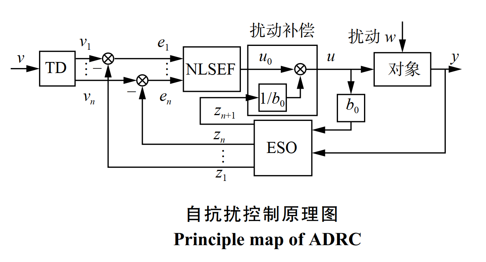

# Part Ⅰ—ADRC

## 1.1 自抗扰控制原理

ADRC(Active Disturbance Rejection Control)，包括跟踪微分器 (tracking differentiator，TD)、非线性
状态误差反馈控制律 (nonlinear state error feedback，NLSEF)和扩张状态观测器 (extended state
observer，ESO)三部分。自抗扰控制的独特之处在于它将作用于被控对象的所有不确定因素均视为“未知扰动”，并利用对象的输入输出信息对其进行实时估计并给予补偿，这种思想突破了“绝对不变性原理”和“内模原理”的局限性，是在发扬 PID 控制的精髓— “基于误差来消除误差”，并吸收现代控制理论成就${^{[1]}}$。

## 1.2 跟踪微分器（TD）

### 1.2.1 非线性(快速)跟踪微分器（TD）原理

**非线性（快速）跟踪微分器原理**

 最快地跟踪输入信号的动态环节获取微分信号${^{[3]}}$。

$$
\begin{align}
&二阶积分串联系统：\begin{cases}
\bold{
\dot x_1 = x_2\\
\dot x_2 = u, |u| \leq r
}
\end{cases}\\
& 以原点为终点的快速最优控制综合函数：
u(x_1,x_2) = -rsign(x_1 + \frac{x_2|x_2|}{2r})\\
& 非线性跟踪微分器：\\
&\begin{cases}
\bold{
\dot x_1 = x_2\\
\dot x_2 = -rsign(x_1-v_0(t) + \frac{x_2|x_2|}{2r})
}
\end{cases}\\

& 上述系统解分量x_1(t)在加速度限制|\ddot x| \leq r ，之下最快跟踪输入信号v_0(t)
，r越大，跟踪越快。\\
& x_1(t)充分接近v_0(t)时，另一个解分量x_2(t)=\dot x_1(t)当做输入v_0(t)的近似微分。
\end{align}
$$
**离散表达式**
$$
\begin{align}
\begin{cases}
f = -rsign(x_1(k)- v(k)+\frac{x_2(k)|x_2(k)|}{2r})\\
x_1(k+1) = x_1(k) + hx_2(k)\\
x_2(k+1) = x_2(k) + hf\\

\end{cases}
\end{align}
$$

### 1.2.2 最速跟踪微分器（TD）原理

**最速跟踪微分器原理**

上述离散之后由于不能在有限步到达设定值，到达设定值后微分输出产生高频振动。将上述函数${f}$改${fhan}$之后。得到的系统为最速离散跟踪微分器，并将${fhan}$ 函数中 ${步长h }$  修改为于系统步长独立的新变量${h_0}$ ，离散表达式分别如下：${^{[3]}}$
$$
\begin{align}
\begin{cases}
fh = fhan(x_1(k)-v(k),x_2(k),r,h)\\
x_1(k+1) = x_1(k) + hx_2(k)\\
x_2(k+1) = x_2(k) + hfh\\

\end{cases}
\end{align}
$$

$$
\begin{align}
\begin{cases}
fh = fhan(x_1(k)-v(k),x_2(k),r,h_0)\\
x_1(k+1) = x_1(k) + hx_2(k)\\
x_2(k+1) = x_2(k) + hfh\\

\end{cases}
\end{align}
$$

${h_0 > h}$  ，${h_0}$ 增大能起到滤波作用，因此将其称为跟踪微分器的滤波因子。

${fhan}$ 函数表达式如下：
$$
\begin{align}
\bold{
u = fhan(x_1,x_2,r,h)\\
fsg = (sign(x+d)-sign(x-d))/2\\
\begin{cases}
d = rh^2\\
a_0 = hx_2 \\
y = x_1 + a_0\\
a_1 = \sqrt{d(d+8|y|)}\\
a_2 = a_0 + sign(y)(a_1-d)/2\\
a = (a_0+y)fsg(y,d)+a_2(1-fsg(y,d))\\
fhan = -r(\frac{a}{d}) -rsign(a)(1-fsg(a,d))\\
\end{cases}
}
\end{align}
$$

# Part Ⅱ—LADRC

# Part Ⅲ—Improved ADRC

# Part Ⅳ —Controlled Object

# Reference

[1] 自抗扰控制: 研究成果总结与展望

[2] 自抗扰控制技术—估计扰动不确定因素的控制技术

[3] 自抗扰控制技术—估计扰动不确定因素的控制技术 p57-71